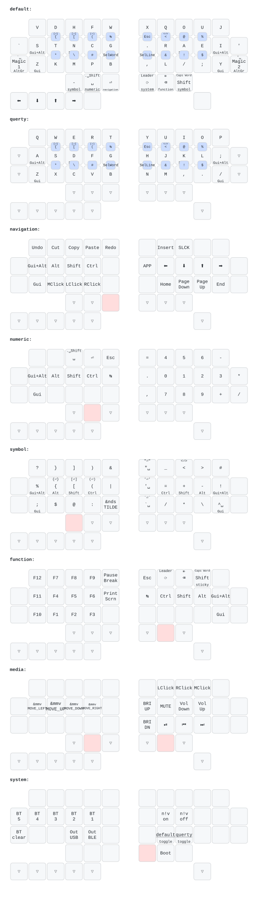

# zmk-config

zmk-config for [duet](https://github.com/zzeneg/duet).

## Keymap

SVG generated by [keymap-drawer](https://github.com/caksoylar/keymap-drawer)

## Magic Macros
Based on [the most common english n-grams](http://phrasesinenglish.org/explorec.html)

| Key | Magic1 | Magic2  |
|-----|--------|---------|
| a   | tion   | bout    |
| b   | ject   | ilit    |
| c   | ause   | tion    |
| d   | ition  | iffer   |
| e   | ment   | ople    |
| f   | eren   | irst    |
| g   | ener   | overn   |
| h   | ould   | ough    |
| i   | onal   | tion    |
| j   | ecti   | ects    |
| k   | nowl   | nown    |
| l   | ation  | ight    |
| m   | ember  | ents    |
| n   | ment   | ation   |
| o   | ther   | ught    |
| p   | oint   | eople   |
| q   | uest   | uire    |
| r   | ight   | ough    |
| s   | sion   | hould   |
| t   | ions   | here    |
| u   | nder   | tion    |
| v   | ision  | elop    |
| w   | orld   | here    |
| x   | peri   | pect    |
| y   | stem   | oung    |
| z   | zled   | ation   |
| ␣   | and␣   | the␣    |
| .   | ./     | ..      |
| ,   | ␣and␣  | ␣but␣   |
| #   | define | include |

last macro output key can be used to start a new macro, this means macros can be concatenated

e.g. 

`g` `Magic2` `Magic1` outputs g[overn][ment] => government

`q` `Magic1` `Magic1` outputs q[uest][ions] => questions

